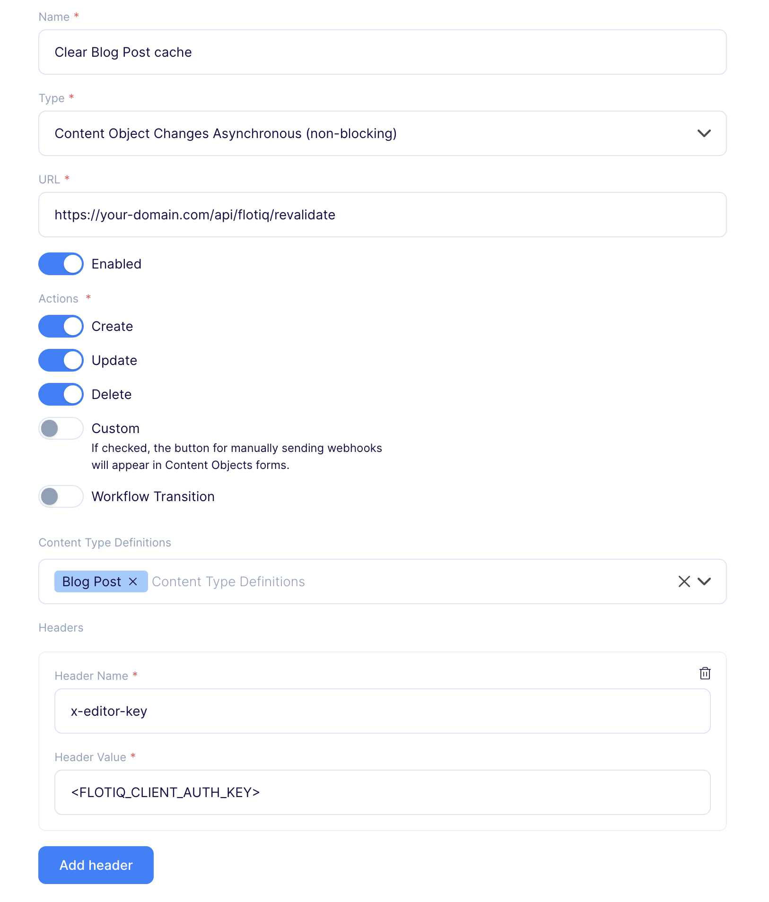

<a href="https://flotiq.com/">
    
</a>

# Next.js starter for a blog with Flotiq source

Kick off your project with this blog boilerplate. This starter ships with the main Next.js configuration files you might need to get up and running blazing fast with the blazing-fast app generator for React.
Check our live demo: https://flotiq-nextjs-blog-starter.vercel.app.

## Quick start

1. **Start the project from the template using git clone**

   ```bash
   git clone https://github.com/flotiq/flotiq-nextjs-blog-starter flotiq-nextjs-blog-starter
   ```

2. **Import example data from starter to Flotiq**

   ```bash
   cd flotiq-nextjs-blog-starter
   npx flotiq-cli import .flotiq [flotiqApiKey]
   ```

   _Note: You need to put your Read and write API key as the `flotiqApiKey` for import to work. You don't need any content types in your account._

3. **Configure application**

   The next step is to configure our application to know from where it has to fetch the data.

   Flotiq provides a tool named [flotiq-setup](https://github.com/flotiq/flotiq-setup)
   for automatically populating `.env` files with your Flotiq API keys.

   ```bash
   npx flotiq-setup --nextjs
   ```

   After executing this command, a browser window will open with the Flotiq login screen. Upon successful authentication,
   the command will automatically generate appropriately filled `.env` files for you.

   _Note: If there are existing .env files in the project, flotiq-setup may overwrite them._

4. **Install dependencies**

   Navigate into your new site's directory and run

   ```bash
   yarn install
   ```

5. **Flotiq API SDK - types**

   This starter uses [@flotiq/flotiq-api-sdk](https://www.npmjs.com/package/@flotiq/flotiq-api-sdk) package as an API client. It includes type generation for autocompletion of user data types.

   Types generated using our typegen command enable fast and typesafe development with Flotiq as a data backend.
   You can still use all the API features without type generation. TypeScript user types can be added or removed at any point in development without code changes required.

   Generated `flotiq-api.d.ts` types can be either committed with your code, or .gitignore-d and generated during development and CI/CD.
   For ease of use, we have already included a `flotiq-api.d.ts` file with types containing type definitions for this starter.

   To regenerate Flotiq SDK you can use [flotiq-api-typegen CLI](https://www.npmjs.com/package/@flotiq/flotiq-api-sdk#flotiq-api-typegen), simply run the command:

   ```bash
      npm exec flotiq-api-typegen
   ```

   Usage examples:

   ```typescript
   import { Flotiq } from "@flotiq/flotiq-api-sdk";

   const api = new Flotiq({
     apiKey: "<YOUR API KEY>",
   });

   await api.content._media.list().then((response) => {
     console.log("media > list", response);
   });
   ```

   You can find more examples of its usage in the [@flotiq/flotiq-api-sdk readme](https://www.npmjs.com/package/@flotiq/flotiq-api-sdk#usage-examples)

   _Note: If you make any changes (additions or deletions) to the content type definitions in your Flotiq account, you will need to rerun the `flotiq-api-typegen` command.
   If you are making changes during development, you can use the `--watch` option, which will regenerate types for you every time you change the content type definition._

6. **Developing**

   Navigate into your new site's directory and start it up.

   ```shell
   yarn dev
   ```

   Your site is now running at `http://localhost:3000`!

   Open the `flotiq-nextjs-blog-starter` directory in your code editor of choice and edit `src/app/page.tsx`. Save your changes, and the browser will update in real-time!

7. **Manage your content using Flotiq editor**

   You can now easily manage your content using [Flotiq editor](https://editor.flotiq.com)

   _Note: If you make any changes (additions or deletions) to the content type definitions in your Flotiq account, you will need to rerun the `flotiq-api-typegen` command.
   If you are making changes during development, you can use the `--watch` option, which will regenerate types for you every time you change the content type definition._

## Deploy

Deploy this starter with one click on [Vercel](https://vercel.com/):

[](https://vercel.com/new/clone?repository-url=https%3A%2F%2Fgithub.com%2Fmniemcewicz%2Fflotiq-nextjs-blog-starter&env=FLOTIQ_API_KEY,FLOTIQ_CLIENT_AUTH_KEY&envDescription=API%20Keys%20needed%20for%20application.&envLink=https%3A%2F%2Fflotiq.com%2Fdocs%2FAPI%2F&project-name=flotiq-nextjs-blog-starter&repository-name=flotiq-nextjs-blog-starter)

You can also deploy this project to [Heroku](https://www.heroku.com/) in 3 minutes:

[](https://heroku.com/deploy?template=https%3A%2F%2Fgithub.com%2Fflotiq%2Fflotiq-nextjs-blog-starter)

Or to [Netlify](https://www.netlify.com/):

[](https://app.netlify.com/start/deploy?repository=https%3A%2F%2Fgithub.com%2Fflotiq%2Fflotiq-nextjs-blog-starter)

### Env variables:

Project requires the following variables to start:

| Name                     | Description                                            |
| ------------------------ | ------------------------------------------------------ |
| `FLOTIQ_CLIENT_AUTH_KEY` | The key used to [revalidate cache](#nextjs-data-cache) |
| `FLOTIQ_API_KEY`         | Flotiq Read API key for blogpost content objects       |

### Next.js Data Cache

This starter utilizes a [data caching mechanism in the Next.js application](https://nextjs.org/docs/app/building-your-application/caching#data-cache). After fetching, the data is cached, which means that the cache must be cleared to see the latest data. In this starter, we provide a special API endpoint that clears the cache. You can call it directly or use webhooks that will do it automatically after saving a blog post (both for adding a new entry and editing an existing one).

#### API Endpoint

To send a request to the endpoint that clears cache, use following command:

```bash
curl -X POST https://your-domain.com/api/flotiq/revalidate \
     -H "x-editor-key: <FLOTIQ_CLIENT_AUTH_KEY>"
```

Replace `https://your-domain.com` with your actual `URL` and `FLOTIQ_CLIENT_AUTH_KEY` with the appropriate authorization key value.

#### Webhooks in Flotiq space

To add a webhook that automatically clears the cache after saving a blog post, follow these instructions:

1. Go to [Flotiq dashboard](https://editor.flotiq.com/login)
2. Go to the _Webhooks_ page and click _Add new webhook_
3. Name the webhook (e.g. Clear Blog Post cache)
4. Paste the URL to your revalidate endpoint, eg. `https://your-domain.com/api/flotiq/revalidate`
5. As a webhook type choose **Content Object Changes Asynchronous (non-blocking)**
6. Enable the webhook
7. As a trigger, choose **Create**, **Update** and **Delete** actions on the **Blog Post** Content Type
8. Add new header with following fields:
   - **Header Name** - `x-editor-key`
   - **Header Value** - value for `FLOTIQ_CLIENT_AUTH_KEY` env variable in your deployment
9. Save the webhook

Example webhook configuration:



**Warning!** The webhook URL must be public. In development mode, caching is not applied, so the user does not need to worry about manually clearing the cache on `http://localhost:3000`.

## Learning Next.js

Looking for more guidance? Full documentation for Next.js live [on the website](https://nextjs.org/). Here are some places to start:

- **To dive straight into code samples, head [to the Next.js documentation](https://nextjs.org/docs/getting-started).** In particular, check out the _Guides_, _API Reference_, and _Advanced Tutorials_ sections in the sidebar.

## Collaborating

If you wish to talk with us about this project, feel free to hop on our [](https://discord.gg/FwXcHnX).

If you found a bug, please report it in [issues](https://github.com/flotiq/flotiq-nextjs-blog-starter/issues).
